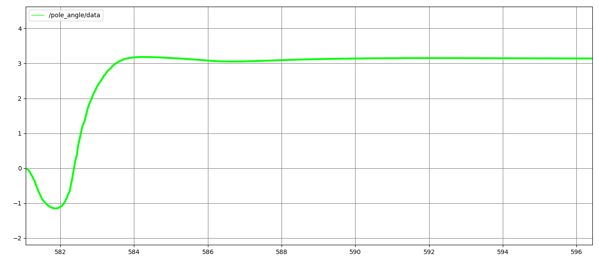

# Cart Pole Swing-Up Reinforcement Learning
## ROS2 Support Branch
**This branch includes ROS2 (Humble) integration**

## Overview
In this final project, reinforcement learning is used to implement control for **swinging a pole on a cart from a downward position to a vertically upright position** and then maintaining balance while keeping the cart at the center of the track.

Swing-up control requires more advanced control than simple balance maintenance, and since it is a system that cannot be controlled with linear control, reinforcement learning is effective. The Proximal Policy Optimization (PPO) algorithm, which can handle continuous action spaces, is adopted as the policy learning algorithm.

The implementation utilizes the **RSL RL** library and the **Genesis** environment.

## Objectives

1. Maintain the pendulum in an upright position (π rad) from downward position (0 rad)
2. Keep the cart within ± 2.5m physical limits
3. Keep the cart at origin
3. Achieve stabele operation

## Testing Environment
- AMD Ryzen 7 5700X
- RTX 3060 Ti
- CUDA 11.8
- RAM 32GB
- Ubuntu 22.04
- ROS2 humble
- Python 3.10

## Demo Video
  

## Installation and Usage

```bash
python3.10 -m venv cart-pole-rl
source cart-pole-rl/bin/activate
```
Install pytorch with matching CUDA version (CUDA 11.8 is utilized in this repo)
```bash
pip install torch==2.5.1+cu118 torchvision==0.20.1+cu118 torchaudio==2.5.1 -f https://download.pytorch.org/whl/torch_stable.html
```
Install Genesis
```bash
pip install git+https://github.com/Genesis-Embodied-AI/Genesis.git
```

Clone Genesis reopsitory and install locally
```bash
cd
git clone https://github.com/Genesis-Embodied-AI/Genesis.git
cd Genesis
pip install -e ".[dev]"
```
Install rsl_rl library locally
```bash
cd
git clone https://github.com/leggedrobotics/rsl_rl
cd rsl_rl && git checkout v1.0.2 && pip install -e .
```
Clone this repository (ros2_cartpole branch)
```bash
cd
git clone -b ros2_cartpole https://github.com/knamatame0729/Cart-Pole-RL-Control.git cart_pole_rl_control
pip install tensorboard
```

Run train script
```bash
cd cart_pole_rl_control
python3 cart_pole_train.py
```
Run this on the other terminal and follow discription to see train detail
```bash
cd cart_pole_rl_control
tensorboard --logdir logs
```
After complete training, run this to watch the training result
```bash
python3 cart_pole_eval.py
```

## Reward Functions

1. **Reward for Pole Upright**  
Encourage the pole to swing from the downward position to the upright position (Swing-Up)

<div align="center">

  

  

</div>
  


2. **Reward for Upright Stability**  
To remain stable near the upright position

<div align="center">


</div>

3. **Penalty for Action Rate**  
To ensure smooth and stable control, reducing the oscillations in the pole and cart during the swing-up phase  

<div align="center">


</div>

4. **Penalty for Cart Position Deviation**  
Add a penalty for the cart moving away from x = 0 to keep the cart centered

<div align="center">


</div>


## Train Detail

#### Mean Espisode Length

<div align="center">


</div>

#### Mean Reward 

<div align="center">


</div>

## Evaluation Metrics
#### Cart Position (m)

#### Cart Velocity (m/s)
  

#### Pole Angle (rad)
  

#### Pole Velocity (rad/s)
  

#### Control Force (N)
  

## References
- Nikita Rudin, David Hoeller, Philipp Reist, and Marco Hutter.  
**"Learning to Walk in Minutes Using Massively Parallel Deep Reinforcement Learning."**  
Proceedings of the 5th Conference on Robot Learning (CoRL 2022), PMLR 164:91–100, 2022.  
[Link to paper](https://proceedings.mlr.press/v164/rudin22a.html)  

- Genesis Authors. **Genesis: A Generative and Universal Physics Engine for Robotics and Beyond**, December 2024.  
[https://github.com/Genesis-Embodied-AI/Genesis](https://github.com/Genesis-Embodied-AI/Genesis)

## License
MIT Liense
