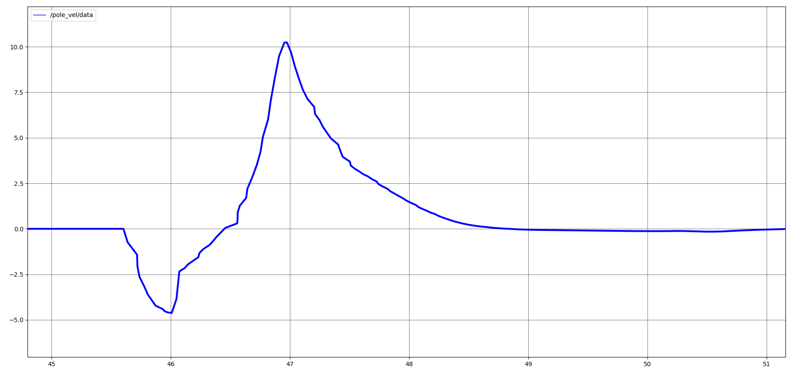

# Cart Pole Swing-Up Reinforcement Learning
## ROS2 Support Branch
**This branch includes ROS2 (Humble) integration**

## Overview
This repository enable to implement a **CartPole environment** for training reinforcement learning (RL) agents to solve the classic control problem of balancing a pole on a cart while keeping the cart near the origin. The environment trains agents to **swing the pole up from a downward position to an upright position** and maintain the cart at the center

## Objectives

1. Maintain the pendulum in an upright position (π rad) from downward position (0 rad)
2. Keep the cart within ± 2.5m physical limits
3. Keep the cart at origin
3. Achieve stabele operation

## Testing Environment
- AMD Ryzen 7 5700X
- RTX 3060 Ti
- CUDA 11.8
- RAM 32GB
- Ubuntu 22.04
- ROS2 humble
- Python 3.10

## Demo Video
  

## Installation and Usage

```bash
python3.10 -m venv cart-pole-rl
source cart-pole-rl/bin/activate
```
Install pytorch with matching CUDA version (CUDA 11.8 is utilized in this repo)
```bash
pip install torch==2.5.1+cu118 torchvision==0.20.1+cu118 torchaudio==2.5.1 -f https://download.pytorch.org/whl/torch_stable.html
```
Install Genesis
```bash
pip install git+https://github.com/Genesis-Embodied-AI/Genesis.git
```

Clone Genesis reopsitory and install locally
```bash
cd
git clone https://github.com/Genesis-Embodied-AI/Genesis.git
cd Genesis
pip install -e ".[dev]"
```
Install rsl_rl library locally
```bash
cd
git clone https://github.com/leggedrobotics/rsl_rl
cd rsl_rl && git checkout v1.0.2 && pip install -e .
```
Clone this repository (ros2_cartpole branch)
```bash
cd
git clone -b ros2_cartpole https://github.com/knamatame0729/Cart-Pole-RL-Control.git cart_pole_rl_control
pip install tensorboard
```

Run train script
```bash
cd cart_pole_rl_control
python3 cart_pole_train.py
```
Run this on the other terminal and follow discription to see train detail
```bash
cd cart_pole_rl_control
tensorboard --logdir logs
```
After complete training, run this to watch the training result
```bash
python3 cart_pole_eval.py
```

## Reward Functions

1. **Reward for Pole Upright**  
Encourage the pole to swing from the downward position to the upright position (Swing-Up)
- At $\theta(t) = \pi$ (upright), $\cos(\pi) = -1$, ${\text{→}}$ $r_{\text{upright}} = 1 - (-1) = 2.0$
- At $\theta(t) = 0$ (upright), $\cos(0) = 1$, ${\text{→}}$ $r_{\text{upright}} = 1 - 1 = 0.0$

$$r_{\text{upright}}(t) = 1 - \cos(\theta(t))$$
  


2. **Reward for Upright Stability**  
To remain stable near the upright position

$$r_{\text{upright\_stable}}(t) = \begin{cases} 
1.0 & \text{if } |\theta(t) - \pi| < \theta_{\text{threshold}}(0.3 & rad), \\
0.0 & \text{otherwise},
\end{cases}$$

3. **Penalty for Action Rate**  
To ensure smooth and stable control, reducing the oscillations in the pole and cart during the swing-up phase  

$$r_{\text{action\_rate}}(t) = -\sum_{i=1}^{n_{\text{actions}}} \left( a_i(t) - a_i(t-1) \right)^2$$

4. **Penalty for Cart Position Deviation**  
Add a penalty for the cart moving away from x = 0 to keep the cart centered

$$r_{\text{cart\_pos}}(t) = -x(t)^2$$


## Evaluation Metrics
#### Cart Position (m)

#### Cart Velocity (m/s)
  

#### Pole Angle (rad)
  

#### Pole Velocity (rad/s)
  

#### Control Force (N)
  

## References
- Nikita Rudin, David Hoeller, Philipp Reist, and Marco Hutter.  
**"Learning to Walk in Minutes Using Massively Parallel Deep Reinforcement Learning."**  
Proceedings of the 5th Conference on Robot Learning (CoRL 2022), PMLR 164:91–100, 2022.  
[Link to paper](https://proceedings.mlr.press/v164/rudin22a.html)  

- Genesis Authors. **Genesis: A Generative and Universal Physics Engine for Robotics and Beyond**, December 2024.  
[https://github.com/Genesis-Embodied-AI/Genesis](https://github.com/Genesis-Embodied-AI/Genesis)

## License
MIT Liense
