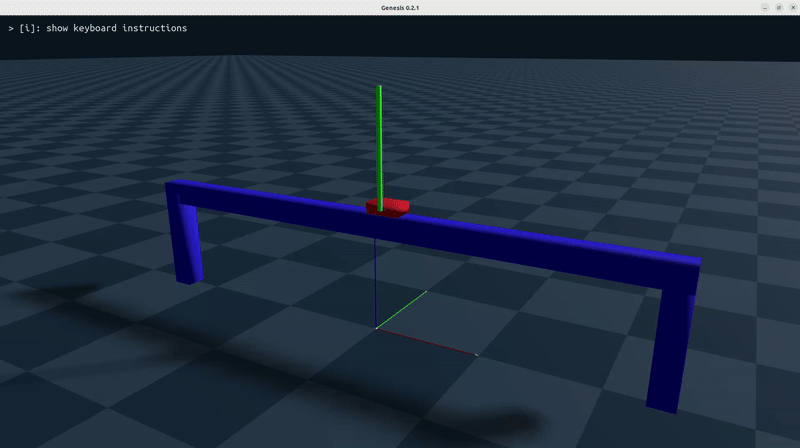

# Cart Pole Swing-Up Reinforcement Learning
## ROS2 Support Branch
**This branch includes ROS2 (Humble) integration**

## Overview
This repository enable to implement a **CartPole environment** for training reinforcement learning (RL) agents to solve the classic control problem of balancing a pole on a cart while keeping the cart near the origin. The environment trains agents to **swing the pole up from a downward position to an upright position** and maintain the cart at the center

## Testing Environment
- AMD Ryzen 7 5700X
- RTX 3060 Ti
- CUDA 11.8
- RAM 32GB
- Ubuntu 22.04
- ROS2 humble
- Python 3.10

## Demo Video
  

## Installation and Usage

```bash
python3.10 -m venv cart-pole-rl
source cart-pole-rl/bin/activate
```
Install pytorch with matching CUDA version (CUDA 11.8 is utilized in this repo)
```bash
pip install torch==2.5.1+cu118 torchvision==0.20.1+cu118 torchaudio==2.5.1 -f https://download.pytorch.org/whl/torch_stable.html
```
Install Genesis
```bash
pip install git+https://github.com/Genesis-Embodied-AI/Genesis.git
```

Clone Genesis reopsitory and install locally
```bash
cd
git clone https://github.com/Genesis-Embodied-AI/Genesis.git
cd Genesis
pip install -e ".[dev]"
```
Install rsl_rl library locally
```bash
cd
git clone https://github.com/leggedrobotics/rsl_rl
cd rsl_rl && git checkout v1.0.2 && pip install -e .
```
Clone this repository (ros2_cartpole branch)
```bash
cd
git clone -b ros2_cartpole https://github.com/knamatame0729/Cart-Pole-RL-Control.git cart_pole_rl_control
pip install tensorboard
```

Run train script
```bash
cd cart_pole_rl_control
python3 cart_pole_train.py
```
Run this on the other terminal and follow discription to see train detail
```bash
cd cart_pole_rl_control
tensorboard --logdir logs
```
After complete training, run this to watch the training result
```bash
python3 cart_pole_eval.py
```

## References
- Nikita Rudin, David Hoeller, Philipp Reist, and Marco Hutter.  
**"Learning to Walk in Minutes Using Massively Parallel Deep Reinforcement Learning."**  
Proceedings of the 5th Conference on Robot Learning (CoRL 2022), PMLR 164:91–100, 2022.  
[Link to paper](https://proceedings.mlr.press/v164/rudin22a.html)  

- Genesis Authors. **Genesis: A Generative and Universal Physics Engine for Robotics and Beyond**, December 2024.  
[https://github.com/Genesis-Embodied-AI/Genesis](https://github.com/Genesis-Embodied-AI/Genesis)

## License
MIT Liense
